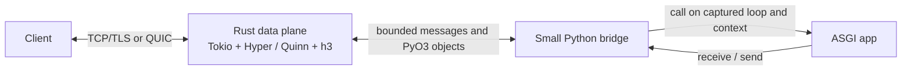

# Architecture and buffer ownership

## Runtime boundary

The server uses two schedulers for different work. Tokio owns socket readiness,
HTTP framing, protocol state, transport flow control, and connection tasks.
Python's already-running asyncio loop owns the ASGI callable, Python task
creation, `contextvars`, application exceptions, and application-owned async
resources. When configured, uvloop is the Python asyncio implementation; it does
not replace Tokio.

The CLI imports `module:attribute`, selects asyncio or optional uvloop, and
starts the Rust server from that event loop. PyO3's asyncio integration
dispatches ASGI calls back to the captured loop. Application code never runs on
Tokio workers. The Python bridge wraps Rust-backed `receive()` and `send()`
operations in the ASGI callable shape; it does not parse HTTP or manage sockets.

## Buffer ownership and copies

The optimization goal is to avoid copies where Rust can safely retain Python's
immutable object owner. `pyo3`'s `bytes` feature provides a safe conversion to
`bytes::Bytes`; this server does not construct a `Vec<u8>` intermediate for
these outgoing payloads.

| Direction and value | Current path | Copy behavior |
|---|---|---|
| Python `http.response.body` immutable `bytes` → Rust response body | PyO3 extracts `bytes::Bytes` directly | Payload is retained with its Python owner; no payload copy at extraction. |
| Python `websocket.send` binary `bytes` → Rust frame | PyO3 extracts `Option<Bytes>` directly | Payload is retained; no intermediate `Vec<u8>` or `Bytes::from(Vec)` copy. |
| Python ASGI header pairs → Rust headers | Extracts `Vec<(Bytes, Bytes)>` | Immutable field values retain Python owners; the vector of pairs is allocated. |
| Exact built-in ASGI event `type` string → Rust dispatch | Compare against cached interned Python strings | Known HTTP, WebSocket, and lifespan event names avoid a Rust `String` allocation. Unknown event names and `str` subclasses use the owned-string fallback; standard names carried by subclasses still dispatch normally. |
| Python `bytearray` → Rust payload | PyO3 converts to owned `Bytes` | A snapshot is copied because the Python buffer is mutable and Rust needs stable ownership while writing. |
| Incoming HTTP body → ASGI `http.request` body | Rust transport `Bytes` → Python `bytes` | Copied when constructing the Python `bytes` object required by ASGI. |
| Request scope path, query, and headers → Python | Rust protocol values → Python `bytes` objects | Python objects and their contents are allocated/copied at the ASGI boundary. |
| Python text WebSocket message → Rust frame | Python `str` → Rust `String`/frame bytes | Encoding and owned frame storage require work; the current bytes fast path does not apply. |

“Zero-copy” here refers only to retaining immutable Python-owned outgoing byte
payloads during extraction. It does not mean the whole request/response path is
zero-copy. `PyBytes::new` is used for Rust-to-Python ASGI payloads; the ASGI
contract exposes Python `bytes`, so that direction currently allocates a Python
object and copies the payload. Header containers, ASGI scopes, Python message
dictionaries, and protocol framing still require allocations or copies. The
known built-in event-name fast path removes only its small Rust string
allocation; it does not remove the Python dictionary lookup, ASGI call, or
bridge scheduling work.
The optimization adds no unsafe Rust and leaves `unsafe_code = "forbid"`
enabled.

Do not adopt a copy-size threshold based on intuition. In a separate benchmark
trial, copying small payloads into fresh Python `bytes` at or below 1 KiB was
slower on fixed and chunked workloads and increased large-response sampled RSS;
the implementation keeps direct owner-backed extraction for all immutable
`bytes`. Results and trial artifacts are in
[the feasibility report](feasibility.md).

## Streaming and backpressure

The HTTP request-body message channel is bounded to one pending item; the HTTP
response-body message channel holds four pending items. The WebSocket message
queues are bounded to eight messages. The ASGI app receives request data
incrementally. Awaiting a Python `send()` waits for capacity downstream, so a
slow peer propagates backpressure to the app instead of allowing an unbounded
body queue to accumulate. The four-item response buffer is a measured latency
tradeoff, not a guarantee of higher throughput; the latest focused H1 result
still trails Uvicorn on chunk-heavy responses.

The bound is on message count, not byte size: one message can be large. The
server currently exposes no application-configurable maximum request-body size.
HTTP flow control belongs to Hyper; QUIC and HTTP/3 flow control belong to Quinn
and `h3`.

## Context, exceptions, and cancellation

Each ASGI call is created on the Python event loop that started the server and
uses the captured context. App exceptions are carried back as Python exceptions
so the Python traceback is available at the boundary. Disconnect and shutdown
cancellation schedule cancellation on that same loop. A Rust future being
dropped alone is not considered Python task cancellation.

These claims have targeted live probes for context, exceptions, disconnect,
send-after-disconnect, and shutdown cancellation. They are not a complete
ASGI conformance proof; see the [support matrix](support-matrix.md).

## Protocol ownership

Hyper handles HTTP/1.1 and HTTP/2 over TCP, including HTTP/2 cleartext prior
knowledge and TLS ALPN. Quinn plus `h3` handles experimental HTTP/3 over QUIC.
`tokio-tungstenite` handles WebSockets over HTTP/1.1 upgrade. HTTP/2 extended
CONNECT and HTTP/3 WebSockets are not implemented. Lifespan startup completes
before the listeners accept requests; shutdown stops accepting, drains active
work to the configured deadline, cancels remaining tasks, then sends lifespan
shutdown.
