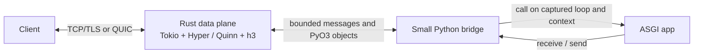

# Architecture and buffer ownership

The current 490-case matrix passes attribution and three full repeats. It
contains 238 live oracle comparisons and 252 target-only contracts across 70
input files and 71 operations. Native coverage is 5,108/5,108 regions and
3,608/3,608 lines, with zero Coverage MCP gaps. The normal non-instrumented
local build passes all 238 public parity cases. See the [current source/build
receipt](coverage.md#current-full-verification-490-cases). Older 485-, 451-,
and 448-case results below are historical and do not attest the current
checkout.

## Runtime boundary

The server uses two schedulers for different work. Tokio owns socket readiness,
HTTP framing, protocol state, transport flow control, and connection tasks.
Python's already-running asyncio loop owns the ASGI callable, Python task
creation, `contextvars`, application exceptions, and application-owned async
resources. When configured, uvloop is the Python asyncio implementation; it does
not replace Tokio.

The CLI imports `module:attribute`, selects asyncio or optional uvloop, and
starts the Rust server from that event loop. PyO3's asyncio integration
dispatches ASGI calls back to the captured loop. Application code never runs on
Tokio workers. The Python bridge wraps Rust-backed `receive()` and `send()`
operations in the ASGI callable shape; it does not parse HTTP or manage sockets.

The native module builds its Tokio runtime at import with two worker threads
and registers the completed runtime with PyO3's async integration. A
process-wide `OnceLock<Result<Runtime, io::Error>>` retains either the runtime
or its construction failure. Construction failures become Python `OSError`
before the native exports are added; repeated initialization returns the
cached failure. If the async integration already has a valid registered
runtime, that runtime remains registered. Runtime construction is fallible,
and its effect on import/startup cost needs a fresh benchmark.

Exact built-in ASGI event names compare against PyO3's interned strings,
avoiding the classifier's temporary Rust string. Fixed scope/message keys,
Python method lookups and common HTTP method caches are not implemented in the
canonical source. Its method path still calls `to_ascii_uppercase()`.
Key/value caching and one-worker Tokio builds remain unaccepted experiments:
their timing rows were rejected by the host-contention gate. HTTP path decoding retains a
borrowed `Cow<str>` when the path is already valid UTF-8 and needs no percent
decoding, avoiding an intermediate Rust `String` before creating the required
Python string. These changes do not remove dictionary lookups, message
dictionaries, event-loop handoffs, or Python ASGI calls; their performance
effect still needs a valid paired A/B measurement. See the
[October 5 investigation](performance-investigation-2026-10-05.md).

## Response completion and application ownership

The final `http.response.body` message (`more_body: false`) completes the HTTP
response. The transport does not wait for the Python application to return.
When the body adapter emits the final frame, it immediately transfers the
running application task to a tracked observer, or observes its already
completed result. Post-response background work can finish and its Python
exception or native task failure remains observable. The response body then
has terminal state; later polls return no frame. Dropping an unfinished
response still cancels its running application.

The HTTP/1.1 and HTTP/2 `http.response-final-before-app-return` parity workflows
check both response completion before application return and completion of the
background work. They passed the historical shared-write 448-case attribution and all three
complete matrix repeats after the normal-build exclusion correction.
These lifecycle checks identify a source of
response latency; they do not measure a throughput improvement or replace a
release benchmark.

## Buffer ownership and copies

The optimization goal is to avoid copies where Rust can safely retain Python's
immutable object owner. `pyo3`'s `bytes` feature provides a safe conversion to
`bytes::Bytes`; this server does not construct a `Vec<u8>` intermediate for
these outgoing payloads.

| Direction and value | Current path | Copy behavior |
|---|---|---|
| Python `http.response.body` immutable `bytes` → Rust response body | PyO3 extracts `bytes::Bytes` directly | Payload is retained with its Python owner; no payload copy at extraction. |
| Python `websocket.send` binary `bytes` → Rust frame | PyO3 extracts `Option<Bytes>` directly | Payload is retained; no intermediate `Vec<u8>` or `Bytes::from(Vec)` copy. |
| Python ASGI header pairs → Rust headers | Extracts `Vec<(Bytes, Bytes)>` | Immutable field values retain Python owners; the vector of pairs is allocated. |
| Exact built-in ASGI event `type` string → Rust dispatch | Compare against cached interned Python strings | Known HTTP, WebSocket, and lifespan event names avoid a Rust `String` allocation. Unknown event names and `str` subclasses use the owned-string fallback; standard names carried by subclasses still dispatch normally. |
| Python `bytearray` → Rust payload | PyO3 converts to owned `Bytes` | A snapshot is copied because the Python buffer is mutable and Rust needs stable ownership while writing. |
| Incoming HTTP body → ASGI `http.request` body | Rust transport `Bytes` → Python `bytes` | Copied when constructing the Python `bytes` object required by ASGI. |
| Request scope path, query, and headers → Python | Rust protocol values → Python `bytes` objects | Python objects and their contents are allocated/copied at the ASGI boundary. |
| Python text WebSocket message → Rust frame | Python `str` → Rust `String`/frame bytes | Encoding and owned frame storage require work; the current bytes fast path does not apply. |

“Zero-copy” here refers only to retaining immutable Python-owned outgoing byte
payloads during extraction. It does not mean the whole request/response path is
zero-copy. `PyBytes::new` is used for Rust-to-Python ASGI payloads; the ASGI
contract exposes Python `bytes`, so that direction currently allocates a Python
object and copies the payload. Header containers, ASGI scopes, Python message
dictionaries, and protocol framing still require allocations or copies. The
known built-in event-name fast path removes only its small Rust string
allocation; it does not remove the Python dictionary lookup, ASGI call, or
bridge scheduling work.
The optimization adds no unsafe Rust and leaves `unsafe_code = "forbid"`
enabled.

Do not adopt a copy-size threshold based on intuition. In a separate benchmark
trial, copying small payloads into fresh Python `bytes` at or below 1 KiB was
slower on fixed and chunked workloads and increased large-response sampled RSS;
the implementation keeps direct owner-backed extraction for all immutable
`bytes`. Results and trial artifacts are in
[the feasibility report](feasibility.md).

## Vectored transport writes

`ConnectionIo` forwards `is_write_vectored` and `poll_write_vectored` to its
underlying transport alongside scalar `poll_write`. Hyper can then select its
queued writer when supported and retain header/body slices instead of flattening
body buffers into a new write buffer. The earlier plaintext H1 profile observed
that copy path disappear; it was a wall-stack observation, not a speed result.

A private borrowed scalar/vectored buffer enum selects the underlying write
operation, with one shared fallible handler. Both paths preserve the original
write error and mark the connection closed; the enum adds no payload copy,
allocation, dynamic dispatch or unsafe Rust. It does not change ASGI message
ordering, Python task/context ownership or backpressure. TLS still encrypts
and buffers data; forwarding vectored capability does not make TLS copy-free.
See [the investigation](performance-investigation-2026-10-05.md) and the
[source-bound coverage receipt](coverage.md#current-full-verification-448-cases).

## Streaming and backpressure

The HTTP request-body message channel is bounded to one pending item; the HTTP
response-body message channel holds sixteen pending items. The WebSocket
message queues are bounded to eight messages. The ASGI app receives request
data incrementally. Awaiting a Python `send()` waits for capacity downstream,
so a slow peer propagates backpressure to the app instead of allowing an
unbounded body queue to accumulate. The 16-item response buffer is a measured
latency/throughput tradeoff, not a guarantee of higher performance. The October 4
historical H1 matrix was contaminated by unrelated CPU work and showed workload-specific
rate gains on chunk-heavy responses alongside about twice the server CPU; its
results remain provisional pending a quiet-host rerun.

The bound is on message count, not byte size: one message can be large. The
server currently exposes no application-configurable maximum request-body size.
HTTP flow control belongs to Hyper; QUIC and HTTP/3 flow control belong to Quinn
and `h3`.

## Header capacity and response commitment

Response and WebSocket acceptance headers use the pinned `http` crate's finite
`HeaderMap` storage. Its internal bucket ceiling does not define a stable
public accepted-header count; distinct names, duplicate values, map growth, and
reserved handshake headers affect capacity differently. This is a compiled
capacity boundary, not a configurable CLI limit.

HTTP header construction uses `try_append`
before committing response state, then moves the finished map into the
response. WebSocket construction retains the application task guard until
fallible handshake header assembly succeeds. Capacity failures follow the
native `Result` channel and existing public failure/cleanup behavior. Both valid
large-header support contracts passed a nine-case targeted snapshot, including
the small HTTP 500 recovery, rejected WebSocket handshake, application cleanup,
and healthy follow-ups. Both also pass attribution and all three complete
repeats in the historical shared-write 448-case full verification and the selected normal-build
audit. See
[coverage evidence](coverage.md#historical-targeted-verification-9-cases-fallible-header-assembly).

## Context, exceptions, and cancellation

Each ASGI call is created on the Python event loop that started the server and
uses the captured context. App exceptions are carried back as Python exceptions
so the Python traceback is available at the boundary. Disconnect and shutdown
cancellation schedule cancellation on that same loop. A Rust future being
dropped alone is not considered Python task cancellation.

Task-setup failures before Python task creation retain their original `PyErr`.
The starter closes the bridge awaitable it still owns and sends that exception
through the native result channel. The native future receives the original
exception when task delivery closes. A secondary error closing the awaitable
is reported separately and cannot replace the setup exception.

Every Python task bridge receives a required cleanup tracker. When an
unfinished bridge is dropped, it schedules cancellation on its captured Python
loop and tracks the actual task-completion signal. If callback registration
fails after task creation, the starter retains the original exception and
tracks an awaiter on the same loop and context. This also accounts for an
asynchronous `finally` block entered by an eager Python task. A secondary
cleanup error is logged without replacing the registration exception.
Lifespan retains its existing optional-support fallback for application errors.

The tracker records ownership and completion; it does not force Python code to
finish. Cancellation can be suppressed, and application cleanup can exceed its
configured window. Explicit Rust failures follow `Result`/`PyResult`; the lint
and fault-case policy does not prove recovery from process-wide allocation
failure or dependency unwinds.

These claims have targeted live probes for context, exceptions, disconnect,
send-after-disconnect, and shutdown cancellation. They are not a complete
ASGI conformance proof; see the [support matrix](support-matrix.md).

## Protocol ownership

Hyper handles HTTP/1.1 and HTTP/2 over TCP, including HTTP/2 cleartext prior
knowledge and TLS ALPN. Quinn plus `h3` handles experimental HTTP/3 over QUIC.
`tokio-tungstenite` handles WebSockets over HTTP/1.1 upgrade. HTTP/2 extended
CONNECT and HTTP/3 WebSockets are not implemented. Lifespan startup completes
before the listeners accept requests.

The H3 accept loop treats typed `H3_NO_ERROR` (`0x100`) and unknown remote
HTTP/3 application close codes as clean peer closure, as required by
[RFC 9114 section 8](https://www.rfc-editor.org/rfc/rfc9114.html#section-8).
Cases cover zero, reserved GREASE `0x21`, unknown `0x111`, and
maximum u62. Registered HTTP/3-family application codes `0x33`, `0x101`, and
`0x200` retain the error path. The public workflows check exact response bytes,
a fresh connection, scoped diagnostics and graceful exit. They do not send a
QUIC transport `CONNECTION_CLOSE` frame; transport-close behavior remains
unverified.

While accepting new H3 requests, the connection loop joins completed owned
request tasks and observes their results. On a real acceptance error it closes
the peer with `H3_INTERNAL_ERROR` (`0x102`), aborts pending owned requests, drains
their join results, and then returns the original error. The server-level H3
task set owns the graceful-shutdown deadline.
The current held-response workflow checks this final drain through wire-visible
outcomes:
receive an actual body chunk, arm the existing accept-error point, advance the
pending accept with a same-connection request, and observe remote closure,
cancellation diagnostics and Python cleanup before a fresh request. This adds
no native point or panic and passed its selected instrumented case (1/1).
The 450-case full gate left two final-drain regions uncovered; the enlarged
matrix's fresh full verification covers both through this case and passes all
473 attribution cases plus three full repeats. Actual remote application close
`0x102`, body-stream error, connection closure and cleanup prove connection-error
termination/cancellation; the probe's `stream_reset` error convention alone
does not identify a QUIC `RESET_STREAM` frame. See the
[workflow contract](parity.md#current-http3-workflows) and
[source-bound status](coverage.md#current-evidence-status).

## Shutdown ownership and stages

Shutdown explicitly drops the TCP listener after its accept loop ends, before
draining HTTP, HTTP/3, and WebSocket network tasks within a shared transport
grace period. Already accepted responses can finish while new TCP connections
are refused. The strengthened plaintext/TLS workflow records this ordering
before releasing a held response. They also retain a real idle connection
carrying a partial HTTP/2 preface until shutdown and require it to close while
the active response drains. Both cases passed the historical shared-write 448-case full gate.

After explicit graceful cancellation, the native connection driver treats
Hyper's direct interrupted I/O result from pending HTTP version detection as
normal shutdown. Established HTTP errors and the ordinary connection-result
branch retain their error propagation. This classification uses the error type
and kind. Both stronger plaintext/TLS cases pass live parity in attribution and
all three complete repeats of the historical shared-write full matrix.
That seven-case targeted evidence predates the fallible header-capacity correction.

Request application
tasks and their cancellation cleanup are owned by the request tracker.
Post-response applications receive their normal grace period before a Rust
cancellation token tells still-running bridges to schedule Python cancellation.
The server then gives tracked request cleanup a separate bounded window.

HTTP request-body readers have their own server-owned `JoinSet`; H1, H2 and H3
handlers register a pump before starting the corresponding ASGI request task.
Each pump observes server shutdown, connection closure and its request-scoped
cancellation token. H1 drains remaining frames after the ASGI receive channel
closes so the connection can finish request framing and remain reusable. H2
request cancellation signals the token so the bridge can expose
`http.disconnect`; H3 stream errors and closed receivers end the request pump.
The server joins all remaining pumps within the unused transport grace period.
If that deadline expires, it logs the timeout, aborts the pumps, and drains
their join results before returning from `Server.serve()`. The upload channel
remains bounded and retains its existing backpressure. Full-matrix cases cover
early responses, abandoned and partial uploads, body errors, disconnects,
malformed H1 framing, shutdown and healthy sibling/follow-up requests.
The one-connection HTTP/3 case completes 128 one-byte uploads; its instrumented
attribution records 128/128 body pumps joined, and each of the three complete
matrix repeats returns 128/128 responses matching Hypercorn.
See the [current evidence](coverage.md#current-full-verification-490-cases).

Lifespan has a dedicated cleanup tracker. Its main native task remains outside
that tracker while startup and shutdown run, so request cleanup does not wait
for an active lifespan application. Startup failures abort and await the native
task before draining lifespan cleanup. After the bounded lifespan shutdown
phase, the server also aborts and awaits any retained native lifespan task
before waiting for Python cleanup. This ordering makes the bridge's cleanup
registration visible before the tracker is drained.
An abort-on-drop guard remains owned until the native result is observed.
Unexpected destruction aborts the lifespan task before its channels are
released. This ownership passed the historical shared-write full matrix after the exclusion
correction.

Transport and request draining use the configured grace period. ASGI lifespan
shutdown and Python cancellation cleanup each have a 100 ms minimum window,
including when `graceful_timeout` is zero. Total shutdown time can exceed
`graceful_timeout` because transport drain, request cleanup, lifespan shutdown,
and lifespan cleanup have separate windows.
An unfinished cleanup window produces a diagnostic while preserving the
original startup, shutdown, or transport error. The caller's Python loop
remains responsible for its own lifetime. The current matrix declares cases
that snapshot task completion immediately after `Server.serve()` settles,
before probe cleanup, including eager-task asynchronous `finally` work and
bounded incomplete cleanup. These inputs passed attribution and all three
complete repeats in the historical shared-write full matrix. The selected normal-build
fault-exclusion audit also passed.
[Coverage evidence](coverage.md)
defines the measured source/build scope.
